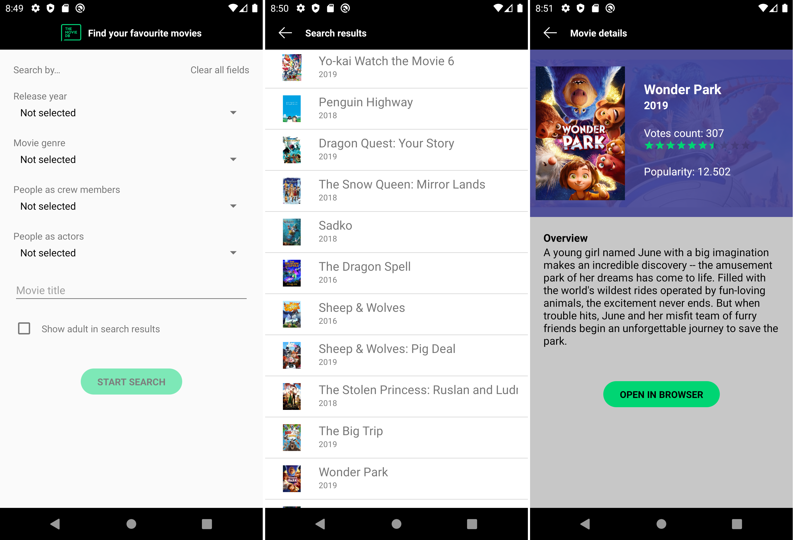

# MovieDbSearch app

Search movies using https://api.themoviedb.org/3 by params like year, genre, actor, crew member.

This api requires an api key to make requests:
1) Create an account https://www.themoviedb.org/
2) Register for an api key https://developers.themoviedb.org/3/getting-started/introduction
3) Add your key in local.properties present in root folder
movie_db_api_key = "xxxxxxxxxxxxxxxxxxxxxxxxxx"

